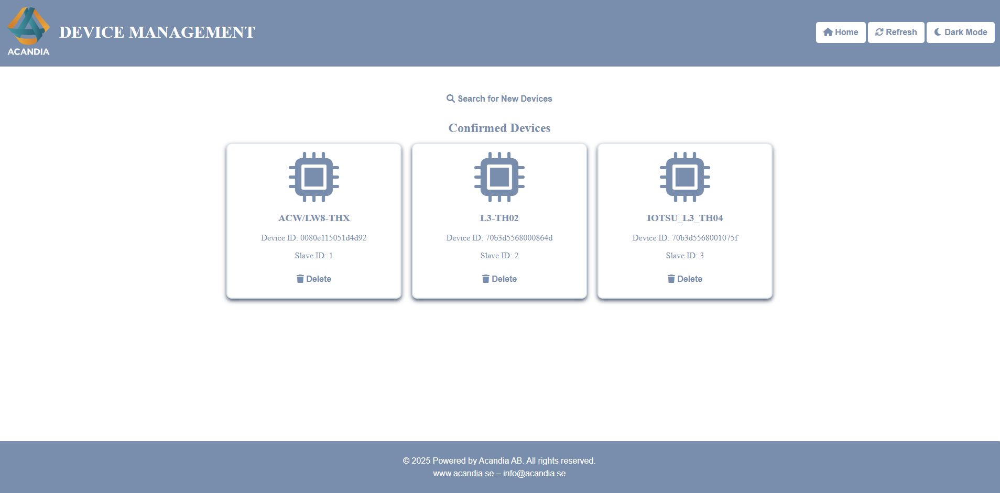
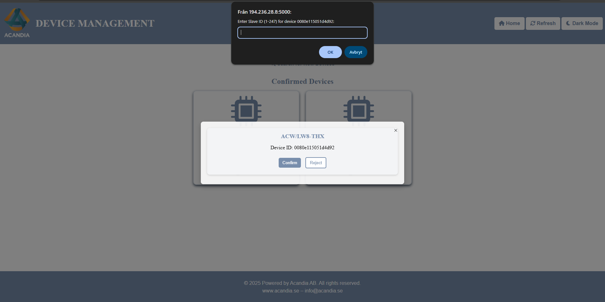

# **Acandia Modbus Data Dashboard Interface**

### **Författare / Author**: Alexander Flores

---

## **Introduktion**

Detta projekt är en proprietär lösning utvecklad av **Alexander Flores** för **Acandia AB** och är avsedd att köras direkt i företagets Robustel-routrar. Systemet fungerar som en brygga som **översätter inkommande LoRaWAN‑telemetri till Modbus‑register** och tillhandahåller ett lättanvänt webbgränssnitt för övervakning av mätdata, enhetshantering samt insyn i registerstrukturen.

---

## 📋 **Nyckelfunktioner**

✅ Enhetshanteringssystem för LoRaWAN‑enheter
✅ Automatisk datavisualisering via Modbus‑register
✅ Realtidsuppdateringar i ett intuitivt UI
✅ Anpassningsbart mörkt läge för bättre användarupplevelse
✅ Detaljerad vy över Modbus‑register och tillhörande telemetri
✅ Manuell sökning och bekräftelse av väntande enheter
✅ Automatisk tidszonsanpassning enligt routerinställning

---

## 🖥️ **Systemarkitektur**

---

## 📷 **Gränssnittets huvudvyer**

### Device Management

Hantera anslutna enheter – lägg till, bekräfta eller avvisa med ett klick.

### Data Table with Modbus Registers

Visualisera telemetri i realtid och granska detaljerad register‑information.

### Add New Device

On‑boarda nya enheter och tilldela Modbus‑slavid i ett och samma steg.

### Slave ID Assignment

Sköt Modbus‑adresseringen smidigt via ett dedikerat gränssnitt.

### Home Page

Översiktspanel som visar samtliga enheter och senaste data.

---

## 🔧 **Tekniker**

* **Python** (Flask, Pymodbus, Paho‑MQTT)
* **HTML / CSS / JavaScript**
* **systemd** (för automatisk uppstart)
* **Robustel‑router** (LoRaWAN & MQTT)
* **JSON** (lättviktig datalagring)

---

## 🏭 **Varför översätta LoRaWAN till Modbus?**

1. **Branschstandard inom OT‑världen** – Modbus (TCP/RTU) är ”lingua franca” för SCADA‑system, PLC\:er, BMS/HVAC och industriella styrsystem. Genom att exponera LoRaWAN‑data som Modbus‑register kan befintliga anläggningar konsumera trådlös sensor‑telemetri utan att uppgradera styrsystemen.
2. **Lång räckvidd + låg effekt** – LoRaWAN levererar batteridrivna sensorer över kilometrar. Konverteringen gör att fjärrmätta värden dyker upp i kontrollrummet lika enkelt som kabelbundna givare.
3. **Sömlös IT/OT‑integrering** – Bryggan i routern minimerar behovet av molntjänster eller extra gateways och låter IT‑teamet skicka MQTT till molnet samtidigt som OT‑teamet läser Modbus lokalt.
4. **Regelverk och validering** – Många reglerade industrier (vatten & avlopp, energi, processindustri) kräver att processdata finns tillgänglig i Modbus‑ eller OPC‑format för revisionsspår och styrfunktioner.

**Resultat:** *En enda trådlös sensorpark kan mata både moln‑API\:er och traditionella SCADA‑system utan dubbla integrationer.*

---

## 📑 **Registerkarta (exempel)**

| Adress (Holding) | Parameter        | Data­typ | Beskrivning                       |
| ---------------- | ---------------- | -------- | --------------------------------- |
| 40001            | Temperature      | INT16    | Sensortemp i °C ×10               |
| 40002            | Humidity         | UINT16   | Relativ luftfuktighet % ×10       |
| 40003            | BatteryVoltage   | UINT16   | Batterispänning i mV              |
| 40004            | RSSI             | INT16    | Signalstyrka dBm                  |
| 40010–40019      | CustomSensor1‑10 | FLOAT32  | Applikationsspecifika värden      |
| 40100            | DeviceStatus     | UINT16   | 0 = OK, 1 = LowBattery, 2 = Fault |

> **Obs!** Register­adresser kan konfigureras per projekt. Tabellen visar ett typiskt default‑schema som levereras med dashboarden.

---

## 🏠 **Fördelar med lokal bearbetning i routern**

* **Ingen moln‑ eller internetberoende drift** – Processen fortsätter även vid WAN‑avbrott.
* **Millisekund‑latens till SCADA/PLC** – All logik körs på samma hårdvara som hanterar Modbus‑frågor.
* **Mindre hårdvarukostnad** – Inget behov av separata industri‑PC\:er eller edge‑gateways.
* **Datasuveränitet & säkerhet** – Telemetri lämnar inte anläggningen om det inte behövs.
* **Centraliserad konfiguration** – Routern är redan IT‑/OT‑bryggan; att lägga konverteringen här förenklar driften.

---

## ❗ **Viktigt meddelande**

Detta projekt är proprietär mjukvara som ägs av **Acandia AB** och är strikt avsett för internt bruk. Otillåten distribution, installation eller modifiering är förbjuden.

---

## 📩 **Kontakt**

För frågor om lösningen eller intern driftsättning, kontakta:
📧 **[alexander.flores@acandia.se](mailto:alexander.flores@acandia.se)**
