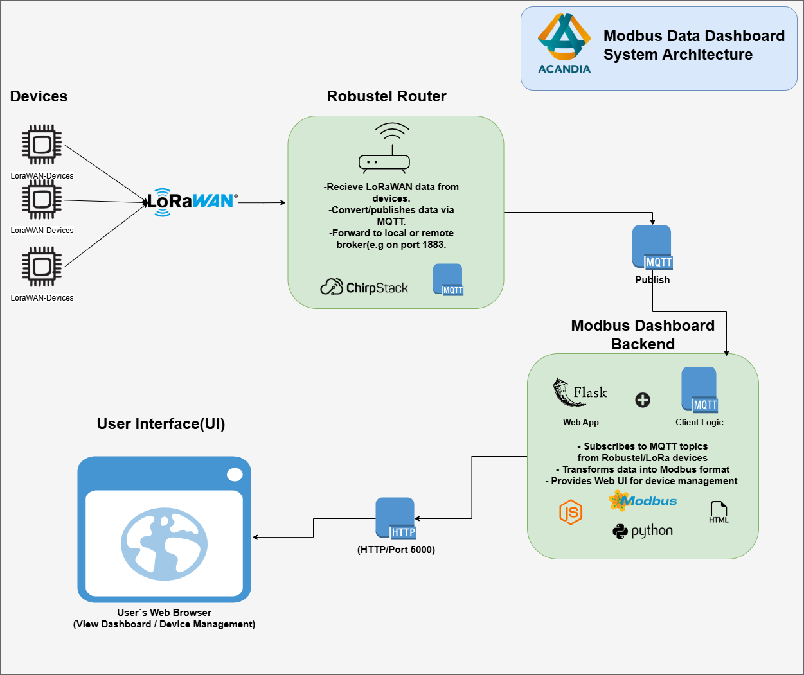
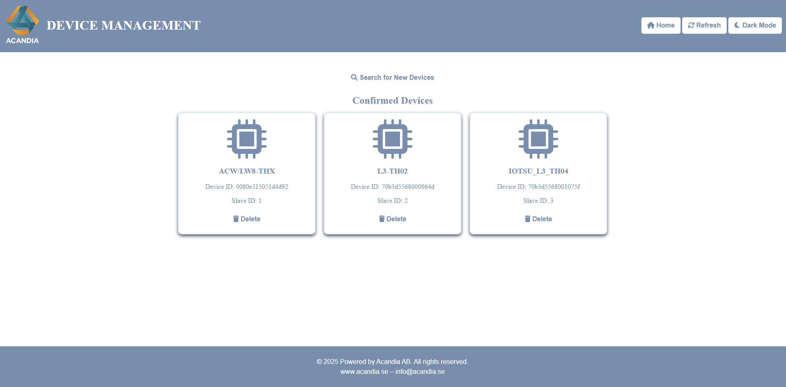
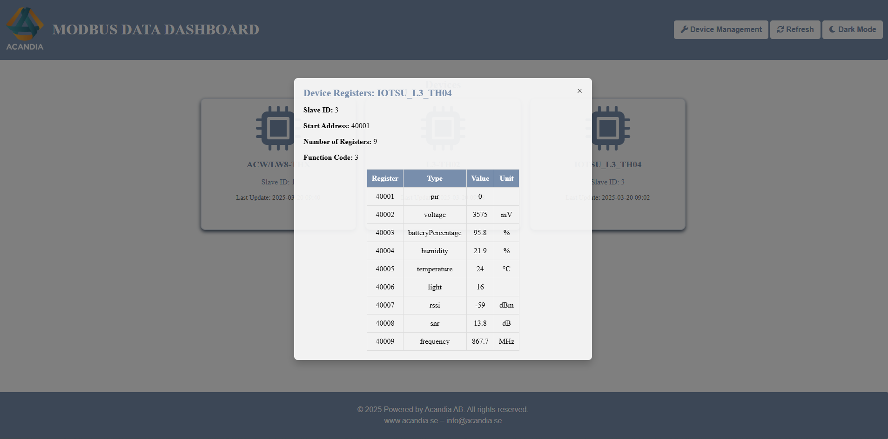
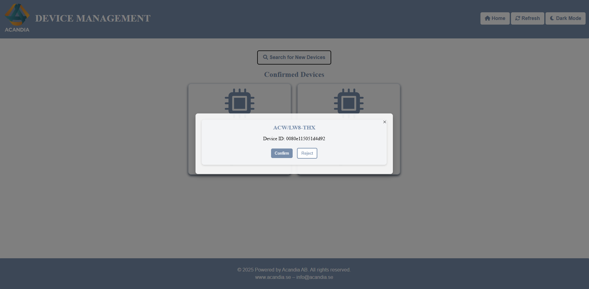
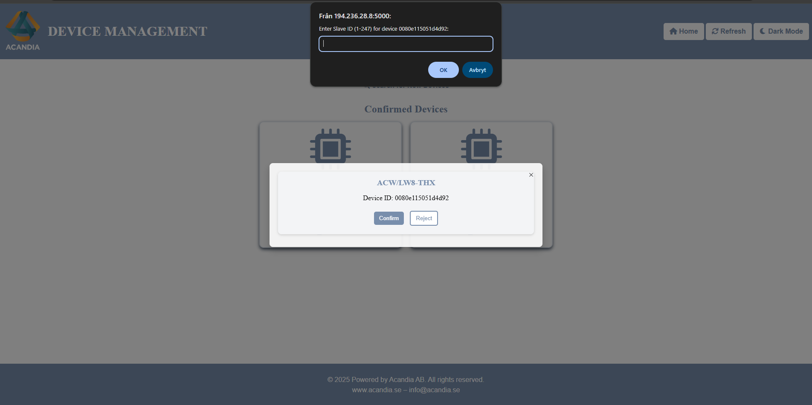
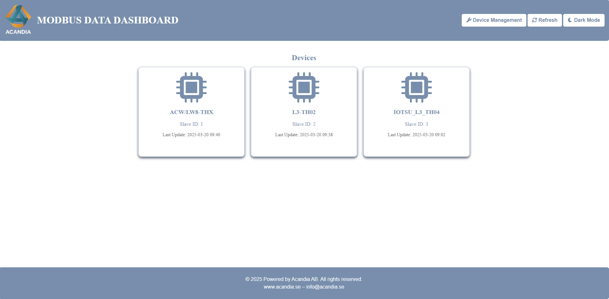

---

# Acandia Modbus Data Dashboard Interface

This project is a proprietary solution developed by **Alexander Flores** to **Acandia AB** for internal use. The Modbus Data Dashboard is designed to provide a comprehensive interface for monitoring and managing LoRaWAN-based devices connected to a Robustel router. The solution visualizes telemetry data, manages devices, and presents detailed register information through an intuitive web interface.

---

## 📋 Key Features

✅ Device Management System for LoRaWAN devices  
✅ Automatic data visualization via Modbus registers  
✅ Real-time telemetry updates with intuitive UI  
✅ Customizable dark mode for improved user experience  
✅ Detailed view of Modbus registers and associated telemetry data  
✅ Manual search and confirmation of pending devices  
✅ Automatic time zone adjustment aligned with router settings  

---

## 🖥️ System Architecture

The following diagram illustrates the system's architecture:

---

## 📷 Interface Overview

### Device Management
Manage connected devices with easy-to-use tools for adding, confirming, or rejecting devices.

### Data Table with Modbus Registers
Visualize real-time data and detailed telemetry information.

### Add New Device
Quickly onboard new devices and assign Modbus Slave IDs.

### Slave ID Assignment
Manage Modbus addresses efficiently through a dedicated interface.

### Home Page
A clear dashboard overview displaying all connected devices and their latest data.

---

## 🔧 Technologies Used

- **Python** (Flask, Pymodbus, Paho-MQTT)  
- **HTML / CSS / JavaScript**  
- **Systemd** (For automatic startup)  
- **Robustel Router** (LoRaWAN & MQTT)  
- **JSON** (For lightweight data storage)  

---

## ❗ Important Notice

This project is proprietary software owned by **Acandia AB** and intended strictly for internal use. Unauthorized distribution, installation, or modification is prohibited.

---

## 📩 Contact Information

For inquiries regarding the solution or internal deployment, please contact:  
📧 **alexander.flores@acandia.se**

---

This version emphasizes the solution’s purpose and functionality while clarifying that it’s not intended for public distribution. Let me know if you'd like to refine any sections. 🚀
